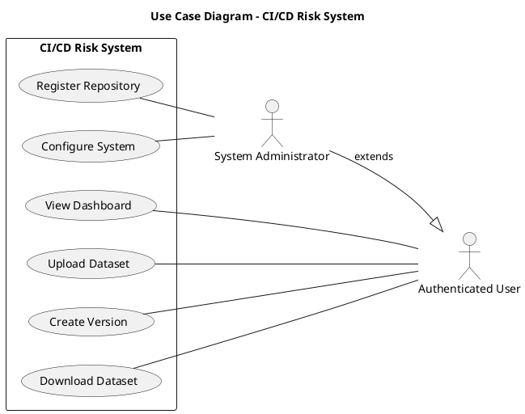

# Hướng Dẫn Cấu Trúc Functional Overview

## I. CẤU TRÚC THAM KHẢO TỪ TIMBERTRACK

Dựa vào cấu trúc của dự án TimberTrack (trong `/Long Chapter 2/2_Survey.tex`), đây là cách họ tổ chức:

### 1. **General Use Case Diagram** (Section 2.2.1)
   - Một hình ảnh UML tổng quát cho toàn bộ hệ thống
   - Liệt kê các Actors (Admin, Staff)
   - Mô tả chung các Main Use Cases (6-8 use cases chính)
   - VD: Manage User, Manage Company, Manage Contract, Manage Permission, etc.

### 2. **Detailed Use Case Diagrams** (Section 2.2.2)
   - Mỗi use case chính được chia thành các chi tiết
   - **Cách tổ chức**: Tách theo Actor và Use Case
     - "Manage Company of Admin" → hình ảnh riêng
     - "Manage Company of Staff" → hình ảnh khác (có quyền khác)
   - Kèm theo mô tả chi tiết (1-2 đoạn văn)
   
### 3. **Business Process Diagrams** (Section 2.2.3)
   - Sơ đồ luồng (Activity Diagram hoặc Flow Diagram)
   - Mô tả các bước cụ thể của một workflow
   - VD: "Add Timber Harvesting" process, "Approval Record" process
   - Có mũi tên, quyết định điều kiện (if/else), etc.

---

## II. CÓ NÊN ÁP DỤNG CHO PROJECT CỦA BẠN KHÔNG?

**CÓ - Nhưng cần ĐIỀU CHỈNH** vì project bạn khác:

❌ **Không cần**:
- Bạn không có nhiều use cases theo Actor như vậy
- Bạn chỉ có 2 flows chính (Flow 1: Live Repo, Flow 2: Dataset Enrichment)

✅ **NÊN THÊM**:
- **General Use Case Diagram**: Hiển thị các actors (Authenticated User, Admin) và các use cases chính:
  - Register Repository
  - View Dashboard
  - Upload & Enrich Dataset
  - Configure System Settings
  - etc.

- **Detailed diagrams cho từng flow**:
  - Flow 1: Live Repository Integration
  - Flow 2: Dataset Enrichment

- **Business Process Diagrams** cho các workflows:
  - Repository Setup & Monitoring
  - Dataset Upload & Enrichment Process
  - Build Risk Evaluation Process

---

## III. CÁC ĐỒ THỊ UML CẦN VẼ

### A. **USE CASE DIAGRAM** (Sẽ hiển thị trong section 2.2.1)

**Actors**:
- `Authenticated User` (extends: `<<user>>`)
- `System Administrator` (extends: `<<user>>`)

**Use Cases**:
1. Register Repository (Admin only)
2. View Dashboard (All users)
3. Upload Dataset (All users)
4. Create Dataset Version (All users)
5. Configure System (Admin only)
6. Download Enriched Dataset (All users)
7. Monitor Pipeline Execution (Admin only)

**Relationships**:
- Admin can do everything Authenticated User can do
- Some use cases are Admin-only (shown with <<include>> or restrictions)

**Tool để vẽ**:
- **Lucidchart** (online, free version)
- **Draw.io** (desktop + online, free)
- **PlantUML** (code-based, có thể tích hợp vào LaTeX)
- **Visio** (nếu có license)

---

### B. **ACTIVITY DIAGRAM** (Sẽ hiển thị trong section 2.2.3 - Business Process)

#### **Activity Diagram 1: Flow 1 - Live Repository Integration**

```
Start
  ↓
Admin registers GitHub repository
  ↓
System validates repository access
  ↓ (success) → Store configuration
  ↓
Backend periodically polls GitHub
  ↓
New workflow run detected?
  ├─ YES → Fetch build metadata
  │          ↓
  │          Run feature extraction pipeline (DAG)
  │          ↓
  │          Extract features from multiple sources
  │          ↓
  │          Run Bayesian model inference
  │          ↓
  │          Store results in DB
  │          ↓
  │          Update dashboard via WebSocket
  │          ↓ (back to polling)
  └─ NO → Continue polling
End
```

#### **Activity Diagram 2: Flow 2 - Dataset Enrichment**

```
Start
  ↓
User uploads CSV dataset
  ↓
System parses file and detects columns
  ↓
User validates and maps required fields (build_id, repo_name)
  ├─ Mapping valid?
  │  ├─ NO → Request correction
  │  └─ YES → Proceed
  ↓
User provides dataset metadata (languages, test frameworks)
  ↓
User selects features for enrichment
  ↓
System infers required data sources
  ↓
Create dataset version
  ↓
Launch Celery enrichment task (async)
  ├─ For each row:
  │  ├─ Extract build_id & repo_name
  │  ├─ Query external APIs (GitHub, SonarQube, etc.)
  │  ├─ Extract selected features
  │  ├─ Row success?
  │  │  ├─ YES → Mark as enriched
  │  │  └─ NO → Mark as failed/skipped
  │  ├─ Update progress
  ↓
Enrichment complete
  ↓
User downloads enriched CSV
  ↓
End
```

---

### C. **SEQUENCE DIAGRAM** (Tuỳ chọn - có thể thêm cho độ chi tiết)

Ví dụ: "Build Risk Evaluation Sequence"

```
Participant: GitHub | Backend | Database | ML Model | Frontend

GitHub → Backend: New workflow run detected
Backend → Database: Store build metadata
Backend → SonarQube: Fetch code metrics
SonarQube → Backend: Return metrics
Backend → ML Model: Run inference with features
ML Model → Backend: Return risk prediction + uncertainty
Backend → Database: Store prediction results
Backend → Frontend: WebSocket notification (real-time update)
Frontend → User: Display updated dashboard
```

---

### D. **DATA FLOW DIAGRAM (DFD)** (Tuỳ chọn)

Hiển thị các sources, processes, stores, sinks:

```
SOURCES (External):
- GitHub API
- Git Repository
- SonarQube API
- Trivy Scanner
- User CSV Upload

↓

PROCESSES:
1. Data Collection (GitHub/Git)
2. Feature Extraction (DAG pipeline)
3. Data Enrichment (SonarQube, Trivy)
4. Model Inference
5. Dataset Enrichment

↓

STORAGE:
- MongoDB (builds, datasets, features)

↓

OUTPUTS:
- Web Dashboard
- Downloadable CSV
- WebSocket real-time updates
```

---

## IV. CÁCH IMPLEMENT TRONG LATEX

### Tuỳ chọn 1: **Chèn hình ảnh PNG/PDF** (giống TimberTrack)
```latex
\begin{figure}[H]
    \centering
    \includegraphics[width=0.8\textwidth]{Figure/use_case_general.png}
    \caption{General use case diagram for CI/CD Build Risk System}
    \label{fig:general_usecase}
\end{figure}
```

### Tuỳ chọn 2: **Dùng TikZ + PlantUML** (code-based)
```latex
\usepackage{tikz}
\usetikzlibrary{shapes, arrows}

% Vẽ trong LaTeX trực tiếp
\begin{tikzpicture}
    % draw actors, use cases, relationships
\end{tikzpicture}
```

### Tuỳ chọn 3: **PlantUML + generate PNG rồi nhúng**
```tex
% File: diagram.puml
@startuml
left to right direction

actor Admin
actor "Authenticated User"
usecase "Register Repository" as UC1
usecase "View Dashboard" as UC2
...
Admin --> UC1
"Authenticated User" --> UC2
@enduml
```

Sau đó generate PNG từ PlantUML rồi chèn vào LaTeX.

---

## V. HƯỚNG DẪN VẼ UML - CÔNG CỤ ĐƯỢC KHUYẾN NGHỊ

### **A. Draw.io** (KHUYẾN NGHỊ - miễn phí, dễ dùng)
1. Truy cập: https://draw.io
2. Click "Create New Diagram"
3. Chọn mẫu "UML"
4. Kéo thả các phần tử:
   - **Actors**: Dùng hình người
   - **Use Cases**: Hình ellipse
   - **Relationships**: Mũi tên (association, include, extend)
   - **Notes**: Hộp ghi chú
5. Export as PNG/PDF
6. Chèn vào LaTeX

**Ưu điểm**:
- ✅ Miễn phí
- ✅ Không cần cài đặt
- ✅ Giao diện thân thiện
- ✅ Export nhanh
- ✅ Có thể lưu trên Google Drive

---

### **B. PlantUML** (KHUYẾN NGHỊ - code-based, version control friendly)
1. Cài: `brew install plantuml` (Mac) hoặc download jar file
2. Tạo file `.puml`:

3. Generate PNG:
```bash
plantuml diagram.puml
```
4. Chèn vào LaTeX

**Ưu điểm**:
- ✅ Code-based (dễ version control)
- ✅ Có thể integrate với CI/CD
- ✅ Miễn phí
- ✅ Chuyên nghiệp

---

### **C. Lucidchart** (Chuyên nghiệp nhưng có phí)
- Tương tự Draw.io nhưng có thêm tính năng
- Miễn phí cho sinh viên (với email .edu)

---

## VI. CẤU TRÚC SỬ DỤNG CHO BẠN

Tôi đề xuất cấu trúc này cho bạn:

```
\section{Functional Overview}
\label{section:2.2}

\subsection{User Roles and Access Control}  ← Đã có

\subsection{High-level System Architecture}  ← Đã có

\subsection{Core Functional Areas}  ← Đã có

\subsection{General Use Case Diagram}  ← CẦN THÊM
  [Hình UML showing all main use cases]
  
  \subsubsection{Actors}
  [Mô tả Admin và Authenticated User]
  
  \subsubsection{Main Use Cases}
  (i) Register Repository
  (ii) View Dashboard
  (iii) Upload Dataset
  ... (6-8 use cases)

\subsection{Detailed Use Case Diagrams}  ← CẦN THÊM
  \subsubsection{Flow 1: Live Repository Integration}
    [Hình chi tiết cho Flow 1]
    [Mô tả chi tiết]
  
  \subsubsection{Flow 2: Dataset Enrichment}
    [Hình chi tiết cho Flow 2]
    [Mô tả chi tiết]

\subsection{Business Process Workflows}  ← ĐỔIYÊN CHỖ TỪ "Business process"
  \subsubsection{Workflow 1: Repository Setup and Monitoring}
    [Activity diagram]
    [Mô tả các bước]
  
  \subsubsection{Workflow 2: Dataset Enrichment Process}
    [Activity diagram]
    [Mô tả các bước]
  
  \subsubsection{Workflow 3: Build Risk Evaluation}
    [Activity diagram]
    [Mô tả các bước]

\subsection{Implementation Status and Future Extensions}  ← Đã có
```

---

## VII. TIMELINE VẼ DIAGRAM

**Tổng thời gian: ~2-3 giờ**

1. **Use Case Diagram** (30 phút)
   - Vẽ bằng Draw.io
   - 2 actors, 6-8 use cases, relationships

2. **Activity Diagrams** (1 giờ)
   - 2-3 activity diagrams cho workflows chính
   - Vẽ từng bước của Flow 1, Flow 2, Evaluation

3. **Kiểm tra & chỉnh sửa** (30 phút)
   - Export PNG với quality cao (300 dpi nếu có)
   - Điều chỉnh kích thước hình
   - Thêm captions và references

---

## VIII. VÍ DỤ SỬ DỤNG PLANTUML

Nếu bạn muốn dùng PlantUML (code-based), tôi có thể tạo các files `.puml` cho bạn:

**File 1: use_cases.puml** - General Use Case
**File 2: flow1_activity.puml** - Live Repo Integration
**File 3: flow2_activity.puml** - Dataset Enrichment
**File 4: evaluation_activity.puml** - Build Risk Evaluation

Sau đó generate PNG và nhúng vào LaTeX.

---

## TỔNG KẾT

| Yếu tố | Chi tiết |
|--------|---------|
| **Cấu trúc** | Sử dụng cấu trúc TimberTrack nhưng điều chỉnh cho 2 flows chính |
| **Diagrams cần** | General UseCase + 3-4 Activity Diagrams |
| **Tool khuyên dùng** | Draw.io (dễ) hoặc PlantUML (chuyên) |
| **Số lượng hình** | ~5-6 hình |
| **Số trang** | ~1-2 trang cho Functional Overview |
| **Thứ tự** | Actors → General UC → Detailed UC/Flows → Business Process |

**Bạn có muốn tôi tạo các PlantUML diagrams mẫu cho bạn không?**
