# QUICK START GUIDE: Vẽ UML Diagrams và Integrate vào LaTeX

## 1. CÁCH 1: Dùng Draw.io (ĐỀ XUẤT - Dễ nhất)

### Bước 1: Truy cập Draw.io
```
https://draw.io
→ Click "Create New Diagram"
→ Chọn "Blank Diagram"
```

### Bước 2: Vẽ Use Case Diagram
**Elements cần dùng:**
- Actors: Search "actor" → drag vào canvas
- Use cases: Search "oval" hoặc "ellipse" → drag vào
- Relationships: Kéo từ actor → use case

**Layout:**
```
                   [Actor 1]
                       |
      ┌────────────────┼────────────────┐
      ↓                ↓                ↓
  [UC1]           [UC2]            [UC3]
      ↓                ↓                ↓
   [UC4] ←──────────────┘           [UC5]
                   [Actor 2]
                       |
      ┌────────────────┼────────────────┐
      ↓                ↓                ↓
  [UC6]           [UC7]            [UC8]
```

### Bước 3: Export PNG
```
Menu → File → Export as
→ Chọn "PNG"
→ Điều chỉnh zoom (150%) để rõ
→ Export
→ Save vào: Figure/diagrams/use_case_general.png
```

### Bước 4: Chèn vào LaTeX
```latex
\begin{figure}[H]
    \centering
    \includegraphics[width=0.9\textwidth]{Figure/diagrams/use_case_general.png}
    \caption{General use case diagram}
    \label{fig:usecase_general}
\end{figure}
```

---

## 2. CÁCH 2: Dùng PlantUML (CHUYÊN NGHIỆP)

### Bước 1: Cài đặt PlantUML

**Mac:**
```bash
brew install plantuml
```

**Linux:**
```bash
sudo apt-get install plantuml
```

**Windows:**
- Download từ: http://plantuml.com/download
- Extract và thêm vào PATH

### Bước 2: Sử dụng files PlantUML có sẵn

Files PlantUML đã được tạo trong folder `/diagrams/`:
```
diagrams/
  ├── use_case_general.puml
  ├── activity_flow1_repository.puml
  ├── activity_flow2_dataset_enrichment.puml
  └── activity_build_risk_evaluation.puml
```

### Bước 3: Generate PNG

**Option A: Dùng script bash**
```bash
cd /path/to/project
chmod +x generate_diagrams.sh
./generate_diagrams.sh
```

**Option B: Manually generate từng file**
```bash
plantuml diagrams/use_case_general.puml -png -o ../Figure/diagrams/
plantuml diagrams/activity_flow1_repository.puml -png -o ../Figure/diagrams/
```

**Option C: Batch generate**
```bash
plantuml diagrams/*.puml -png -o ../Figure/diagrams/
```

### Bước 4: Verify output
```bash
ls Figure/diagrams/
# Sẽ thấy:
# - use_case_general.png
# - activity_flow1_repository.png
# - activity_flow2_dataset_enrichment.png
# - activity_build_risk_evaluation.png
```

---

## 3. CHỈNH SỬA PlantUML FILES

Nếu muốn thay đổi diagrams:

### Bước 1: Mở file .puml bằng text editor
```
diagrams/use_case_general.puml
```

### Bước 2: Chỉnh sửa

```puml
@startuml use_case_general
title My Title Here

' Thêm actors
actor "User" as U
actor "Admin" as A

' Thêm use cases
usecase "Action 1" as UC1
usecase "Action 2" as UC2

' Thêm relationships
U --> UC1
A --> UC2
A --> UC1

@enduml
```


### Bước 3: Regenerate
```bash
plantuml diagrams/use_case_general.puml -png -o ../Figure/diagrams/
```

---

## 4. LATEX INTEGRATION - HOÀN CHỈNH

### Thêm packages cần thiết
```latex
\documentclass[../Main.tex]{subfiles}
\usepackage{graphicx}
\usepackage{float}

\begin{document}
```

### Chèn diagrams
```latex
\section{Functional Overview}
\label{section:2.2}

\subsection{General Use Case Diagram}
\label{subsection:2.2.6}

\begin{figure}[H]
    \centering
    \includegraphics[width=1.0\textwidth]{Figure/diagrams/use_case_general.png}
    \caption{General use case diagram for CI/CD Build Risk System}
    \label{fig:usecase_general}
\end{figure}

Figure~\ref{fig:usecase_general} shows the main actors and use cases...

\subsection{Activity Diagrams}

\subsubsection{Flow 1: Repository Integration}

\begin{figure}[H]
    \centering
    \includegraphics[width=1.0\textwidth]{Figure/diagrams/activity_flow1_repository.png}
    \caption{Live repository integration workflow}
    \label{fig:activity_flow1}
\end{figure}

\subsubsection{Flow 2: Dataset Enrichment}

\begin{figure}[H]
    \centering
    \includegraphics[width=1.0\textwidth]{Figure/diagrams/activity_flow2_dataset_enrichment.png}
    \caption{Dataset enrichment workflow}
    \label{fig:activity_flow2}
\end{figure}

\subsubsection{Build Risk Evaluation}

\begin{figure}[H]
    \centering
    \includegraphics[width=1.0\textwidth]{Figure/diagrams/activity_build_risk_evaluation.png}
    \caption{Build risk evaluation process}
    \label{fig:activity_evaluation}
\end{figure}

\end{document}
```

---

## 5. TIPS & TRICKS

### Image Quality
**Nếu hình quá mờ:**
```bash
# Generate với scale cao hơn
plantuml -DSCALE=2 diagrams/use_case_general.puml -png -o ../Figure/diagrams/
```

**Hoặc trong Draw.io:**
- Export PNG → Set DPI to 300 (thay vì 96)

### File size
**Nếu file PNG quá lớn:**
```bash
# Compress PNG
pngquant --quality=80-90 Figure/diagrams/*.png

# Hoặc dùng ImageMagick
convert input.png -quality 85 -strip output.png
```

### Adjust size trong LaTeX
```latex
% Nhỏ hơn
\includegraphics[width=0.7\textwidth]{...}

% Lớn hơn
\includegraphics[width=1.2\textwidth]{...}

% Custom
\includegraphics[height=5cm]{...}
```

### Captions và Labels
```latex
\begin{figure}[H]
    \centering
    \includegraphics[width=0.85\textwidth]{Figure/diagrams/diagram.png}
    \caption{Mô tả chi tiết về diagram này}
    \label{fig:my_diagram}
\end{figure}

% Reference trong text:
Figure~\ref{fig:my_diagram} shows...
```

---

## 6. KIỂM TRA DANH SÁCH

- [ ] Tạo folder `Figure/diagrams/` (nếu chưa có)
- [ ] Copy files PlantUML vào `diagrams/` folder
- [ ] Cài đặt PlantUML hoặc dùng Draw.io
- [ ] Generate PNG từ PlantUML (hoặc vẽ trên Draw.io)
- [ ] Export vào `Figure/diagrams/`
- [ ] Thêm LaTeX code vào 2_Survey.tex
- [ ] Compile LaTeX để verify
- [ ] Điều chỉnh kích thước hình nếu cần
- [ ] Kiểm tra references (Figure~\ref{...})

---

## 7. TROUBLESHOOTING

**Q: PlantUML không found**
```bash
A: which plantuml
   # Nếu không thấy, cài lại:
   brew install plantuml
```

**Q: PNG không xuất hiện trong LaTeX**
```bash
A: Kiểm tra:
   1. File path đúng không?
   2. File tồn tại không? (ls Figure/diagrams/)
   3. LaTeX compile lại (pdflatex -shell-escape)
```

**Q: Hình quá to/nhỏ**
```bash
A: Điều chỉnh width:
   \includegraphics[width=0.8\textwidth]{...}
   Thử 0.6, 0.8, 1.0, etc.
```

**Q: Muốn thay đổi diagram**
```bash
A: 
   1. Edit file .puml
   2. Regenerate: plantuml diagram.puml -png -o ../Figure/diagrams/
   3. Compile LaTeX lại
```

---

## 8. THỜI GIAN DỰ TÍNH

- **Setup & Installation**: 10 phút
- **Vẽ 4 diagrams**: 1-2 giờ (tùy tool)
- **Export & integrate**: 30 phút
- **Fine-tuning**: 30 phút
- **Total**: ~2-3 giờ

---

## 9. FILES THAM KHẢO

```
📁 project/
├── diagrams/                          ← PlantUML files
│   ├── use_case_general.puml
│   ├── activity_flow1_repository.puml
│   ├── activity_flow2_dataset_enrichment.puml
│   └── activity_build_risk_evaluation.puml
├── Figure/
│   └── diagrams/                      ← Generated PNG
│       ├── use_case_general.png
│       ├── activity_flow1_repository.png
│       ├── activity_flow2_dataset_enrichment.png
│       └── activity_build_risk_evaluation.png
├── repo-data/IT4125E_20205155_Lại_Thế_Hùng/
│   └── Chapter/
│       └── 2_Survey.tex               ← Edited file
├── LATEX_TEMPLATE_FUNCTIONAL_OVERVIEW.tex
├── HUONG_DAN_FUNCTIONAL_OVERVIEW.md
└── generate_diagrams.sh
```

---

**Bạn đã sẵn sàng! Hãy bắt đầu từ Cách 1 (Draw.io) nếu bạn muốn nhanh chóng, hoặc Cách 2 (PlantUML) nếu bạn muốn chuyên nghiệp.**
